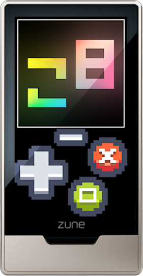

## About the Project

**zuco8** is a Zune HD PICO-8 emulator, based on **open8**
([**ngagesdk/open8**](https://github.com/ngagesdk/open8)).

It is a **fork** that adds compatibility layer that allows to run it on Zune HD
and updates UI to make it more playable on the Zune HD.

There is no working **SDL3** 
([**Simple DirectMedia Layer 3**](https://www.libsdl.org/))
port for Zune HD, so this port is using a smaller subset of it.

Build environment that I used is Windows 7, Visual Studio 2008 SP1 which doesn't
support **C99**, so there is a smaller compatibility layer for that as well.

Zune HD specific code lives under
([**/src/zunehd**](https://github.com/cherepets/zuco8/tree/zunehd/src/zunehd))

## Licence and Credits

- This project is licensed under the "The MIT License".  See the file
  [LICENSE.md](LICENSE.md) for details.

- open8 is a portable PICO-8 emulator written in C99 by Michael Fitzmayer.  See the file
  [LICENSE.md](https://github.com/ngagesdk/open8/blob/main/LICENSE.md) for
  details.

- Pico-8 is a fantasy console by Lexaloffle.  It is not affiliated with this project.
  For more information, visit the [Pico-8 website](https://www.lexaloffle.com/pico-8.php).

- stb by Sean Barrett is licensed under "The MIT License".  See the file
  [LICENSE](https://github.com/nothings/stb/blob/master/LICENSE) for
  details.

- z8lua by Sam Hocevar is used for the Lua interpreter.  It is licensed under the
  "[WTFPL License](http://www.wtfpl.net)".

- OpenZDK by itsnotabigtruck is a native SDK for Zune HD.  It is licensed under the
  [opensource.org/licenses/bsd-license.php](http://www.opensource.org/licenses/bsd-license.php)).

- DeployKit by itsnotabigtruck is used to package and deploy Zune HD native apps.  It is licensed under the
  [MIT License](https://github.com/cherepets/zuco8/blob/zunehd/src/zunehd/package/DeployKit/LICENSE.txt).

- Button design is based on assets by [Kenney](https://kenney.nl/).
